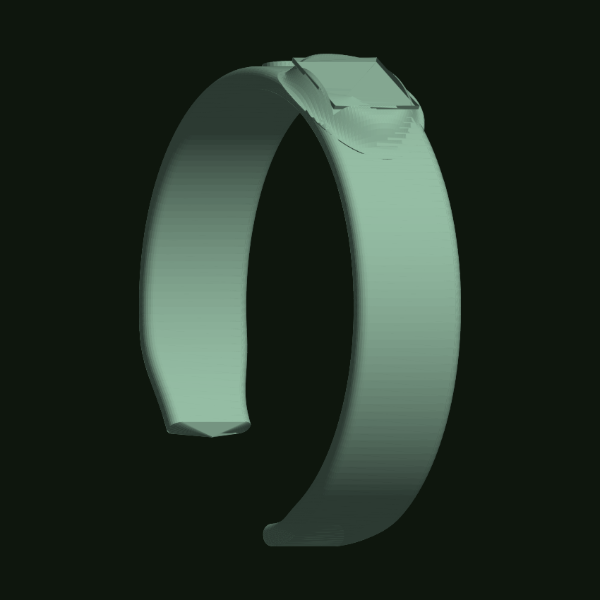

# Pulsera Saferide — modelo 3D

Base para diseñar la pulsera en **Tinkercad** (o cualquier programa 3D / impresora).
Estilo **malla deportiva (smartband)**: correa curva y fina, con un módulo bajo y
ovalado en el centro que lleva el QR y el chip NFC.

| Archivo | Qué es |
|---|---|
| `pulsera_saferide.scad` | **Recomendado.** Se abre con [OpenSCAD](https://openscad.org) (gratis). Cambiás números y se rehace solo; ya tiene el hueco del QR, el bolsillo del NFC y los agujeros de ajuste. F6 → Exportar STL. |
| `pulsera_saferide.stl` | Modelo ya generado, para importar en Tinkercad / meter directo al slicer |
| `gen_pulsera.py` | Genera el `.stl` sin instalar nada (solo Python) |
| `preview.png` | Cómo se ve |

### Si Tinkercad no te funciona

- **OpenSCAD** (lo más simple para esto): instalás, abrís `pulsera_saferide.scad`,
  apretás F5. Editás los números de arriba del archivo y se actualiza. F6 y
  "Exportar como STL" cuando esté listo. No hay que importar nada.
- **BlocksCAD** (blockscad3d.com): bloques tipo Scratch, en el navegador, exporta STL.
- **Fusion 360**: gratis con licencia de estudiante/personal, es CAD profesional.
- Para **solo imprimir** la pulsera tal cual: meté `pulsera_saferide.stl` directo
  en tu slicer (Cura, PrusaSlicer, Bambu Studio) — no hace falta editarla.



## Medidas del modelo actual

- Muñeca: **165 mm** de circunferencia (adulto). La correa **abraza 300°** —
  queda casi cerrada, como una smartband — y se abre solo donde va el cierre.
- Correa: **16 mm de ancho × 3 mm de espesor**, con los **cantos redondeados**
  (sección tipo "D") → cómoda, sin bordes. Se afina un poco hacia las puntas.
- Módulo: **19 × 27 mm**, sobresale solo **3 mm** y **sube en rampa suave** desde
  la correa (sin escalón), como en la foto de referencia.
- **Hueco para el QR** ya incluido en la meseta del módulo: **13 × 13 mm**,
  **0,6 mm** de profundidad (para pegar una etiqueta o para grabar el QR).
- Botoncito redondo al lado del módulo (decorativo / se puede usar para el led).

## Cómo usarlo en Tinkercad

1. Entrá a **tinkercad.com** con tu cuenta de Google → **Crear → Diseño 3D**.
2. Arriba a la derecha: **Importar** → subí `pulsera_saferide.stl`.
   Unidades: **Milímetros**, Escala **100 %**.
3. Aparece la correa. Esperá unos segundos que la procese. Ahora le agregás lo que falta:

### a) Bolsillo para el chip NFC (por debajo del módulo)

- **Cilindro** en modo **Hueco**. Diámetro **27 mm**, alto **2 mm** (disco NFC
  NTAG213/215 de 25 mm). Si usás una "moneda" NFC de 12 mm → diámetro **13 mm**.
- Centralo con el módulo y subilo desde la **cara de abajo** hacia adentro, dejando
  **≥ 1,2 mm** de pared arriba del hueco.
- Seleccionás módulo + cilindro → **Agrupar**.
- El chip se pega adentro y se tapa con un disco fino de TPU (impreso aparte, 0,8 mm).

### b) El QR

- Ya está el recuadro embutido. Ahí pegás una **etiqueta impresa** con el QR
  (mínimo 14 × 14 mm para que escanee; ideal 16 × 16).
- O grabás el QR con láser / lo dejás como bajorrelieve de 0,4 mm y lo pintás.

### c) Cierre de la correa

En las dos puntas de la correa (ahora quedan lisas) agregás:

- **Punta cola**: fila de **7 agujeros Ø2,6 mm**, separados 4 mm (Cilindros en modo Hueco).
- **Punta cabeza**: una **hebilla** simple. En Tinkercad: un marco rectangular
  (caja 16 × 12 mm menos caja 12 × 8 mm) + un cilindro Ø1,8 mm de pasador.
  Alternativa más fácil de imprimir en TPU: **2 pernos tipo remache** (Ø3 mm tallo,
  Ø4,5 mm cabeza) que entran a presión en los agujeros, estilo Xiaomi Mi Band.

## Impresión — TPU (todo el modelo)

Se imprime **entera en filamento TPU** flexible.

- **TPU 95A** (si es 85A, más blando: en el script bajá `WRAP_DEG` a ~195 para que
  no quede tan cerrada).
- Capa **0,15–0,20 mm**, **3 perímetros**, relleno **20–25 %** giroide.
- Velocidad **20–30 mm/s**, retracción baja (0,8–1,5 mm), refrigeración baja o nula.
- Orientación: el conjunto **acostado**, con el módulo hacia arriba. Casi sin soportes.
- Pared mínima en cualquier lado: **1,2 mm** (3 líneas de 0,4).

## Cambiar el tamaño / la forma

Editá los parámetros de arriba de `gen_pulsera.py` y corré:

```bash
python3 gen_pulsera.py
```

| Parámetro | Para qué |
|---|---|
| `WRIST_CIRC` | circunferencia de muñeca (niño ~135–150, adulto ~160–185) |
| `EXTRA_R` / `WRAP_DEG` | qué tan abierta y cerrada queda la correa |
| `STRAP_W` / `STRAP_T` / `EDGE_R` | ancho, espesor y redondeo de la correa |
| `MOD_*` | tamaño del módulo |
| `QR_SIDE` / `QR_DEPTH` | tamaño y profundidad del hueco del QR |
